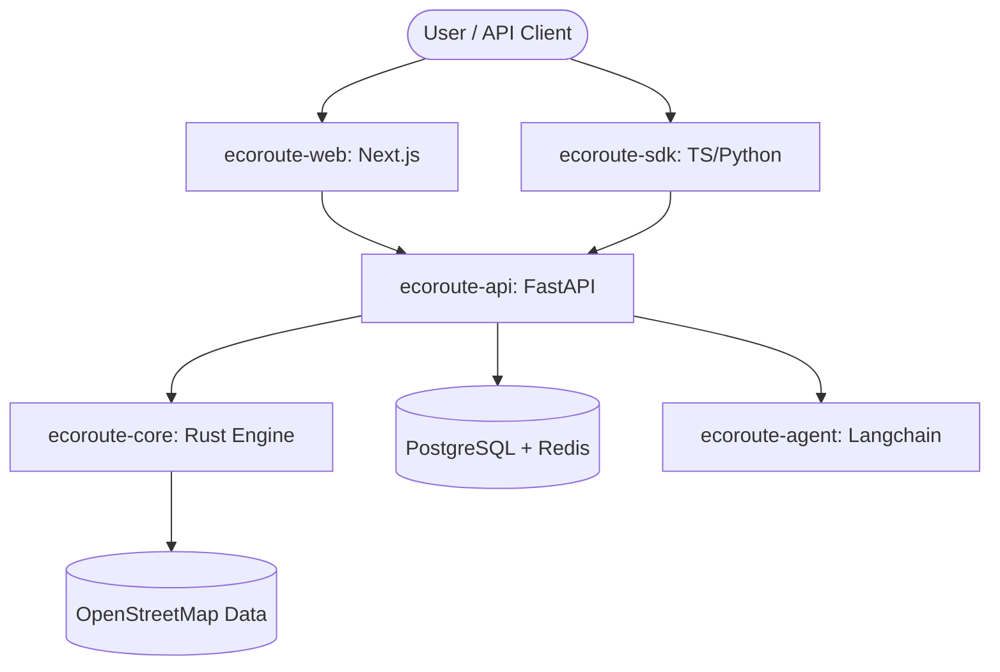

# 🌍 EcoRoute AI

**The Greenest Path Between Two Points.**

EcoRoute is a high-performance routing engine designed to minimize carbon footprints. It combines a high-speed **Rust core** with a **FastAPI backend**, a premium **Next.js dashboard**, and **AI agents** to provide the world's most eco-conscious navigation API.

---

## 🏗 Architecture



### Core Components
- **`ecoroute-core` (Rust)**: The heart of the platform. Implements a generic A* engine with custom physics-based carbon cost functions. Exposes a native Python extension via PyO3.
- **`ecoroute-api` (Python/FastAPI)**: SaaS orchestration layer. Handles Auth (Clerk), Billing (Lemon Squeezy), usage tracking, and OSM data ingestion.
- **`ecoroute-web` (Next.js/TS)**: Premium dashboard for developers. Includes real-time routing visualizations, API playground, and usage analytics.
- **`ecoroute-mobile` (Expo/React Native)**: Prototype consumer app for green navigation.
- **`ecoroute-agent` (Python/Langchain)**: AI-driven route optimization and carbon impact analysis.

---

## 🛠 Tech Stack

- **Core**: Rust (PyO3, KdTree, Serde)
- **Backend**: Python 3.12 (uv, FastAPI, SQLAlchemy, Alembic)
- **Frontend**: Next.js 14, Tailwind CSS, Framer Motion, MapLibre GL
- **Monorepo**: pnpm workspaces + Turborepo (planned)
- **Infrastructure**: Docker, Render, Sentry, Redis, PostgreSQL

---

## 🚀 Getting Started

### Prerequisites
- [Rust Toolchain](https://rustup.rs/) (edition 2024)
- [uv](https://github.com/astral-sh/uv) (Python package manager)
- [Node.js](https://nodejs.org/) (v20+)
- [pnpm](https://pnpm.io/) (v8+)

### Local Development

1. **Clone the repository**:
   ```bash
   git clone https://github.com/rohanbalsaraf/EcoRoute-AI.git
   cd EcoRoute-AI
   ```

2. **Set up Environment**:
   ```bash
   cp .env.example .env
   # Fill in your secrets in .env
   ```

3. **Install Dependencies (Monorepo)**:
   ```bash
   pnpm install
   ```

4. **Spin up Infrastructure**:
   ```bash
   docker-compose up -d
   ```

5. **Run the Dashboard**:
   ```bash
   pnpm --filter ecoroute-web dev
   ```

6. **Run the API**:
   ```bash
   cd packages/ecoroute-api
   uv pip install -e .
   uv run uvicorn app.main:app --reload
   ```

---

## 🤝 Contributing

We welcome contributions! Please see [CONTRIBUTING.md](./CONTRIBUTING.md) for guidelines.

## 📄 License
MIT License. See [LICENSE](LICENSE) for details.
